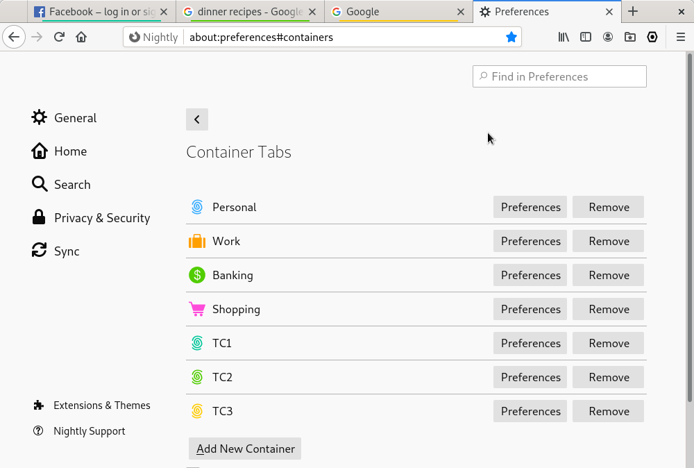

# tabContainer
[**Install for firefox**](https://addons.mozilla.org/en-US/firefox/addon/tabcontainer/)

Derived from the example addons: 'Contextual Identities' https://wiki.mozilla.org/Security/Contextual_Identity_Project/Containers

## What it does
Each new tab opens in a new separate temporary container automatically. When a new browser session starts, all temporary containers from previous session are automatically deleted. This allows to be logged in in different account in different tab at the same time. This is a very simple and lightweight addon that works well with other tab manager addons.

> Note: This extension works only in normal browsing (not in private browser). You need to have enable 'Container Tab' in the preferences.

